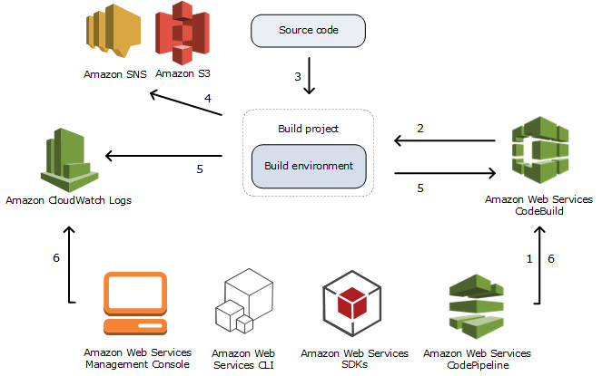

# CI/CD with AWS

## Table of content

- [Your goals](#your-goals)
- [CI/CD Concepts](#cicd-concepts)
- [CI/CD Tools](#cicd-tools)
- [Service Overview](#service-overview)
  - [CodeCommit](#codecommit)
  - [CodeBuild](#codebuild)
  - [CodeDeploy](#codedeploy)
  - [CodePipeline](#codepipeline)
- [Use cases](#use-cases)
- [Cautions](#cautions)
- [Pricing Considerations](#pricing-considerations)
- [More details](#more-details)

## Your goals

- Understand basic concepts of CI/CD
- Be familiar with
  - CodeCommit
  - CodeBuild
  - CodeDeploy
  - CodePipeline
- Know available deployment strategies
- Be familiar with available CodePipeline actions

## CI/CD Concepts

---
*[Source](https://docs.gitlab.com/ee/ci/introduction/)*

CI/CD stands for Continuous Integration and Continuous Deployment/Delivery.

**Continuous integration** is a DevOps software development practice where developers regularly merge their code changes into a central repository, after which automated builds and tests are run. Continuous integration most often refers to the build or integration stage of the software release process and entails both an automation component (e.g. a CI or build service) and a cultural component (e.g. learning to integrate frequently).

*Continuous integration often includes so called pull/merge request builds or checks, i.e. for each pull or merge request new code is checked for compliance with a predefined standard, e.g. compliation must be successful, unit tests must pass, etc.*

**Continuous delivery** is a software development practice where code changes are automatically prepared for a release to production.​

With continuous delivery, every code change is built, tested, and then pushed to a non-production testing or staging environment. There can be multiple, parallel test stages before a production deployment. The difference between **continuous delivery** and **continuous deployment** is the presence of a manual approval to update to production. With continuous deployment, a release to production happens automatically without explicit approval. 

*Though a manual judgement step might be viewed as a slowing factor for the release train, there are domains where such precaution is a business requirement.*

The ultimate goal of CI/CD is to shorten time-to-market. It allows to detect issues as early as possible, which allows to fix them as cheap as possible (e.g. compare discovering a bug in production and effort required to fix it with a failed integration test at pull request stage which covers the same use case). Automating the workflow also saves time and decreases potential amount of errors and issues.

## CI/CD Tools

CI/CD field has a wide variety of tools to choose from. The most well-known solutions include:
- Jenkins
- GitLab
- TravisCI
- GitHub Actions
- TeamCity
- Azure DevOps

Some tools tend to be used for CI rather than CD and vice versa. See comparison with a large list of solutions:
- [G2 Grid Continuous Integration​](https://www.g2.com/categories/continuous-integration#grid)
- [G2 Grid Continuous Delivery](https://www.g2.com/categories/continuous-delivery#grid)

## Service Overview

---

**CodeCommit** is a secure, highly scalable, managed source control service that hosts private Git repositories.​ It provides:
- Integration with other AWS services​
- Pull requests and approval templates​
- Access control​

**CodeBuild** is a fully managed build service in the cloud. ​It's features include:
- Fully managed – CodeBuild eliminates the need to set up, patch, update, and manage your own build servers.​
- On demand – CodeBuild scales on demand to meet your build needs. You pay only for the number of build minutes you consume.​
- Out of the box – CodeBuild provides preconfigured build environments for the most popular programming languages. All you need to do is point to your build script to start your first build.​

**CodeDeploy** is a deployment service that automates application deployments to Amazon EC2 instances, on-premises instances, serverless Lambda functions, or Amazon ECS services. You can deploy:​
- Code​
- Serverless AWS Lambda functions​
- Web and configuration files​
- Executables​
- Packages​
- Scripts​
- Multimedia files
​

**CodePipeline** is a continuous delivery service you can use to model, visualize, and automate the steps required to release your software. It uses other AWS Services as building blocks to automate a workflow.

### CodeCommit

---

[CodeCommit User Guide](https://docs.aws.amazon.com/codecommit/latest/userguide/welcome.html)
- [Getting started with CodeCommit and Git](https://docs.aws.amazon.com/codecommit/latest/userguide/getting-started.html)
- [Managing triggers](https://docs.aws.amazon.com/codecommit/latest/userguide/how-to-notify.html)
- [Managing approval rules templates](https://docs.aws.amazon.com/codecommit/latest/userguide/approval-rule-templates.html)
- [Limit access to branches](https://docs.aws.amazon.com/codecommit/latest/userguide/how-to-conditional-branch.html)

### CodeBuild

---

[CodeBuild User Guide](https://docs.aws.amazon.com/codebuild/latest/userguide/welcome.html)

#### How CodeBuild works

The following diagram shows what happens when you run a build with CodeBuild:

1. As input, you must provide CodeBuild with a build project. A build project includes information about how to run a build, including where to get the source code, which build environment to use, which build commands to run, and where to store the build output. A build environment represents a combination of operating system, programming language runtime, and tools that CodeBuild uses to run a build.

1. CodeBuild uses the build project to create the build environment.

1. CodeBuild downloads the source code into the build environment and then uses the build specification (buildspec), as defined in the build project or included directly in the source code. A buildspec is a collection of build commands and related settings, in YAML format, that CodeBuild uses to run a build.

1. If there is any build output, the build environment uploads its output to an S3 bucket. The build environment can also perform tasks that you specify in the buildspec (for example, sending build notifications to an Amazon SNS topic).

1. While the build is running, the build environment sends information to CodeBuild and Amazon CloudWatch Logs.

1. While the build is running, you can use the AWS CodeBuild console, AWS CLI, or AWS SDKs to get summarized build information from CodeBuild and detailed build information from Amazon CloudWatch Logs. If you use AWS CodePipeline to run builds, you can get limited build information from CodePipeline.

#### Build project

---

Project configuration includes:
- Source
  - Amazon S3
  - AWS CodeCommit
  - GitHub (including GitHub Enterprise)
  - Bitbucket
- [Build environment](https://docs.aws.amazon.com/codebuild/latest/userguide/build-env-ref.html)
- [Buildspec](https://docs.aws.amazon.com/codebuild/latest/userguide/build-spec-ref.html)
- [Batch configuration](https://docs.aws.amazon.com/codebuild/latest/userguide/batch-build.html)

For detailed instructions see [Create build project](https://docs.aws.amazon.com/codebuild/latest/userguide/create-project.html).

#### Test reporting

---

[Working with test reporting](https://docs.aws.amazon.com/codebuild/latest/userguide/test-reporting.html)

CodeBuild allows to create and view test reports for a limited number of supported formats:
- Cucumber JSON (.json)
- JUnit XML (.xml)
- NUnit XML (.xml)
- NUnit3 XML (.xml)
- TestNG XML (.xml)
- Visual Studio TRX (.trx)

For code coverage reporting CodeBuild also provides integration with [CodeCov](https://docs.aws.amazon.com/codebuild/latest/userguide/codecov-integration.html).

### CodeDeploy

---

[CodeDeploy User Guide](https://docs.aws.amazon.com/codedeploy/latest/userguide/welcome.html)

#### Primary components

---

CodeDeploy primary components include:
- [Application](https://docs.aws.amazon.com/codedeploy/latest/userguide/applications.html) is name that uniquely identifies the application you want to deploy. CodeDeploy uses this name, which functions as a container, to ensure the correct combination of revision, deployment configuration, and deployment group are referenced during a deployment.

- [Compute platform](https://docs.aws.amazon.com/codedeploy/latest/userguide/deployment-steps.html) is a platform on which CodeDeploy deploys an application. There are three compute platforms: EC2/On-Premise, AWS Lambda, Amazon ECS.

- [Deployment configuration](https://docs.aws.amazon.com/codedeploy/latest/userguide/deployment-configurations.html) is set of deployment rules and deployment success and failure conditions used by CodeDeploy during a deployment.

- [Deployment group](https://docs.aws.amazon.com/codedeploy/latest/userguide/deployment-groups.html) is a set of individual instances. A deployment group contains individually tagged instances, Amazon EC2 instances in Amazon EC2 Auto Scaling groups, or both.

- [Deployment type](https://docs.aws.amazon.com/codedeploy/latest/userguide/welcome.html#welcome-deployment-overview) is a method used to make the latest application revision available on instances in a deployment group. There are two deployment types: In-place and Blue/Green.

- [IAM instance profile](https://docs.aws.amazon.com/codedeploy/latest/userguide/getting-started-create-iam-instance-profile.html) is an IAM role that you attach to your Amazon EC2 instances. This profile includes the permissions required to access the Amazon S3 buckets or GitHub repositories where the applications are stored.

- [Revision](https://docs.aws.amazon.com/codedeploy/latest/userguide/application-revisions.html) is a version of your application. 
  - An AWS Lambda deployment revision is a YAML- or JSON-formatted file that specifies information about the Lambda function to deploy. AWS Lambda revisions can be stored in Amazon S3 buckets.
  - An EC2/On-Premises deployment revision is an archive file that contains source content (source code, webpages, executable files, and deployment scripts) and an application specification file (AppSpec file). EC2/On-Premises revisions are stored in Amazon S3 buckets or GitHub repositories. 
  - For Amazon S3, a revision is uniquely identified by its Amazon S3 object key and its ETag, version, or both. For GitHub, a revision is uniquely identified by its commit ID.

- Target revision is the most recent version of the application revision that you have uploaded to your repository and want to deploy to the instances in a deployment group. In other words, the application revision currently targeted for deployment. This is also the revision that is pulled for automatic deployments.

- [Service role](https://docs.aws.amazon.com/codedeploy/latest/userguide/getting-started-create-service-role.html) is an IAM role that grants permissions to an AWS service so it can access AWS resources. The policies you attach to the service role determine which AWS resources the service can access and the actions it can perform with those resources. For CodeDeploy, a service role is used for the following:
  - To read either the tags applied to the instances or the Amazon EC2 Auto Scaling group names associated with the instances. This enables CodeDeploy to identify instances to which it can deploy applications.
  - To perform operations on instances, Amazon EC2 Auto Scaling groups, and Elastic Load Balancing load balancers.
  - To publish information to Amazon SNS topics so that notifications can be sent when specified deployment or instance events occur.
  - To retrieve information about CloudWatch alarms to set up alarm monitoring for deployments.

- [AppSpec file](https://docs.aws.amazon.com/codedeploy/latest/userguide/application-specification-files.html) is a YAML-formatted or JSON-formatted file. The AppSpec file is used to manage each deployment as a series of lifecycle event hooks, which are defined in the file.

#### Compute platforms

---

There are three compute platforms:

- **EC2/On-Premise**: Describes instances of physical servers that can be Amazon EC2 cloud instances, on-premises servers, or both. Applications created using the EC2/On-Premises compute platform can be composed of executable files, configuration files, images, and more. Deployments that use the EC2/On-Premises compute platform manage the way in which traffic is directed to instances by using an in-place or blue/green deployment type. For more information, see Overview of CodeDeploy deployment types.
- **AWS Lambda**: Used to deploy applications that consist of an updated version of a Lambda function. AWS Lambda manages the Lambda function in a serverless compute environment made up of a high-availability compute structure. All administration of the compute resources is performed by AWS Lambda. You can manage the way in which traffic is shifted to the updated Lambda function versions during a deployment by choosing a canary, linear, or all-at-once configuration.
- **Amazon ECS**: Used to deploy an Amazon ECS containerized application as a task set. CodeDeploy performs a blue/green deployment by installing an updated version of the application as a new replacement task set. CodeDeploy reroutes production traffic from the original application task set to the replacement task set. The original task set is terminated after a successful deployment. You can manage the way in which traffic is shifted to the updated task set during a deployment by choosing a canary, linear, or all-at-once configuration.

The following table describes how CodeDeploy components are used with each compute platform. For more information, see: 

<table>
<thead>
          <tr>
            <th>CodeDeploy component</th>
            <th>EC2/On-Premises</th>
            <th>AWS Lambda</th>
            <th>Amazon ECS</th>
          </tr>
        </thead>
          <tbody><tr>
            <td>Deployment group</td>
            <td>Deploys a revision to a set of instances.</td>
            <td>Deploys a new version of a serverless Lambda function on a high-availability
              compute infrastructure.</td>
            <td>Specifies the Amazon ECS service with the containerized application to deploy as a
              task set, a production and optional test listener used to serve traffic to the
              deployed application, when to reroute traffic and terminate the deployed application's
              original task set, and optional trigger, alarm, and rollback settings.</td>
          </tr>
          <tr>
            <td>Deployment</td>
            <td>Deploys a new revision that consists of an application and AppSpec file. The
              AppSpec specifies how to deploy the application to the instances in a deployment
              group.</td>
            <td>Shifts production traffic from one version of a Lambda function to a new version
              of the same function. The AppSpec file specifies which Lambda function version to
              deploy.</td>
            <td>Deploys an updated version of an Amazon ECS containerized application as a new,
              replacement task set. CodeDeploy reroutes production traffic from the task set with the
              original version to the new replacement task set with the updated version. When the
              deployment completes, the original task set is terminated.</td>
          </tr>
          <tr>
            <td>Deployment configuration</td>
            <td>Settings that determine the deployment speed and the minimum number of instances
              that must be healthy at any point during a deployment.</td>
            <td>Settings that determine how traffic is shifted to the updated Lambda function
              versions.</td>
            <td>Settings that determine how traffic is shifted to the updated Amazon ECS task
              set.</td>
          </tr>
          <tr>
            <td>Revision</td>
            <td>A combination of an AppSpec file and application files, such as executables,
              configuration files, and so on.</td>
            <td>An AppSpec file that specifies which Lambda function to deploy and Lambda functions
              that can run validation tests during deployment lifecycle event hooks.</td>
            <td>
              
An AppSpec file that specifies:

              <ul class="itemizedlist" type="disc"><li class="listitem">
                  
The Amazon ECS task definition for the Amazon ECS service with the containerized
                    application to deploy.

                </li><li class="listitem">
                  
The container where your updated application is deployed.

                </li><li class="listitem">
                  
A port for the container where production traffic is rerouted. 

                </li><li class="listitem">
                  
Optional network configuration settings and Lambda functions that can run
                    validation tests during deployment lifecycle event hooks.

                </li></ul>
            </td>
          </tr>
          <tr>
            <td>Application</td>
            <td>A collection of deployment groups and revisions. An EC2/On-Premises
              application uses the EC2/On-Premises compute platform.</td>
            <td>A collection of deployment groups and revisions. An application used for an
              AWS Lambda deployment uses the serverless AWS Lambda compute platform.</td>
            <td>A collection of deployment groups and revisions. An application used for an Amazon ECS
              deployment uses the Amazon ECS compute platform.</td>
          </tr>
        </tbody>
</table>

#### Deployment configuration

---

If your deployment uses the EC2/On-Premises compute platform, you can specify the minimum number of healthy instances for the deployment. If your deployment uses the AWS Lambda or the Amazon ECS compute platform, you can specify how traffic is routed to your updated Lambda function or ECS task set.

The following deployment configurations specify how traffic is routed during a deployment that uses the Lambda or the ECS compute platform:
- Canary: Traffic is shifted in two increments. You can choose from predefined canary options that specify the percentage of traffic shifted to your updated Lambda function or ECS task set in the first increment and the interval, in minutes, before the remaining traffic is shifted in the second increment.
- Linear: Traffic is shifted in equal increments with an equal number of minutes between each increment. You can choose from predefined linear options that specify the percentage of traffic shifted in each increment and the number of minutes between each increment.
- All-at-once: All traffic is shifted from the original Lambda function or ECS task set to the updated function or task set all at once.

#### Deployment types

---

[In-place deployment](https://docs.aws.amazon.com/codedeploy/latest/userguide/welcome.html#welcome-deployment-overview-in-place)

[Blue/green deployment](https://docs.aws.amazon.com/codedeploy/latest/userguide/welcome.html#welcome-deployment-overview-blue-green)

### CodePipeline

---

[CodePipeline User Guide](https://docs.aws.amazon.com/codepipeline/latest/userguide/welcome.html) 

CodePipeline allows to model, visualize and automate a workflow. Each pipeline describes a workflow and consists of stages. A stage is a logical unit you can use to isolate an environment and to limit the number of concurrent changes in that environment. Each stage is made up of a series of serial or parallel actions.

[CodePipeline actions](https://docs.aws.amazon.com/codepipeline/latest/userguide/integrations-action-type.html) provide a wide variety of AWS and third-party services. The diagram below lists available actions by type:

## Use cases

CI/CD tools that AWS provides are rarely used compared to their competitors like Jenkins, GitLab, etc. It's generally regarded as:
- expensive, especially compared to open source tools like Jenkins
- having limited capabilities for integration with non-AWS solutions
- somewhat cumbersome in configuration

However, it fits well for useResource 	Default
 
## Cautions

The following limits apply per-region and can be changed:

|Resource|Default|
|---|---|
|Length of time before an action times out|AWS CloudFormation deployment action: 3 days CodeBuild build action and test action: 8 hours CodeDeploy and  CodeDeploy ECS (blue/green) deployment actions: 5 days AWS Lambda invoke action: 20 minutes Amazon S3 deployment action: 20 minutes Step Functions invoke action: 7 days Custom actions: 24 hours All other actions: 1 hour|
|Maximum number of total pipelines per Region in an AWS account|1000 Pipelines configured for either polling or event-based change detection are counted toward this quota.|
|Maximum number of pipelines set to polling for source changes, per AWS Region|300 This quota is fixed and cannot be changed. If you reach the limit for polling pipelines, you can still configure additional pipelines that use event-based change detection.|
|Maximum number of webhooks per Region in an AWS account|300|
|Number of custom actions per Region in an AWS account|50|

The following limits are fixed and cannot be changed:

|Resource|Default|
|---|---|
|Maximum number of actions per pipeline|500|
|Maximum number of months that pipeline execution history information is retained|12|
|Maximum number of parallel actions in a stage|50|
|Maximum number of sequential actions in a stage|50|
|Number of actions in a stage|Minimum of 1, maximum of 50|
|Number of stages in a pipeline|Minimum of 2, maximum of 50|

For a full list of limitations see [Quotas in AWS CodePipeline](https://docs.aws.amazon.com/codepipeline/latest/userguide/limits.html).

## Pricing considerations 

[Pricing Calculator](https://calculator.aws/#/createCalculator/CodePipeline)
[AWS Free Tier](https://aws.amazon.com/free)

|Service|Free Tier|Expires|
|---|---|---|
|CodeCommit|First 5 active users 1,000 repositories per account; up to 25,000 upon request 50 GB-month of storage 10,000 Git requests/month|No|
|CodeBuild|100 build minutes of build.general1.small per month|No|
|CodeDeploy|For CodeDeploy on EC2, Lambda, ECS|No|
|CodePipeline|1 free active pipeline each month|No|

## More details 

### AWS Documentation

- [Best practices for CI/CD from AWS​](https://docs.aws.amazon.com/whitepapers/latest/practicing-continuous-integration-continuous-delivery/summary-of-best-practices.html)
- [AWS CodeCommit UserGuide​](https://docs.aws.amazon.com/codecommit/latest/userguide/welcome.html)
- [AWS CodeBuild UserGuide​](https://docs.aws.amazon.com/codebuild/latest/userguide/welcome.html)
- [AWS CodeDeploy UserGuide​](https://docs.aws.amazon.com/codedeploy/latest/userguide/welcome.html)

### AWS Whitepapers

- [Practicing Continuous Integration and Continuous Delivery on AWS​](https://docs.aws.amazon.com/whitepapers/latest/practicing-continuous-integration-continuous-delivery/practicing-continuous-integration-continuous-delivery.pdf)
- [Overview of Deployment Options on AWS​](https://d1.awsstatic.com/whitepapers/overview-of-deployment-options-on-aws.pdf)
- [Serverless CI/CD for the Enterprise on the AWS Cloud​](https://aws-quickstart.s3.amazonaws.com/quickstart-trek10-serverless-enterprise-cicd/doc/serverless-cicd-for-the-enterprise-on-the-aws-cloud.pdf)

### Meetups

- [DevOps Minsk Meetup: Современный CI для автопилота: как ускорить Time2Market в 5 раз (и что такое KPI)](https://www.youtube.com/watch?v=RKfZ-JWv5Gw)
